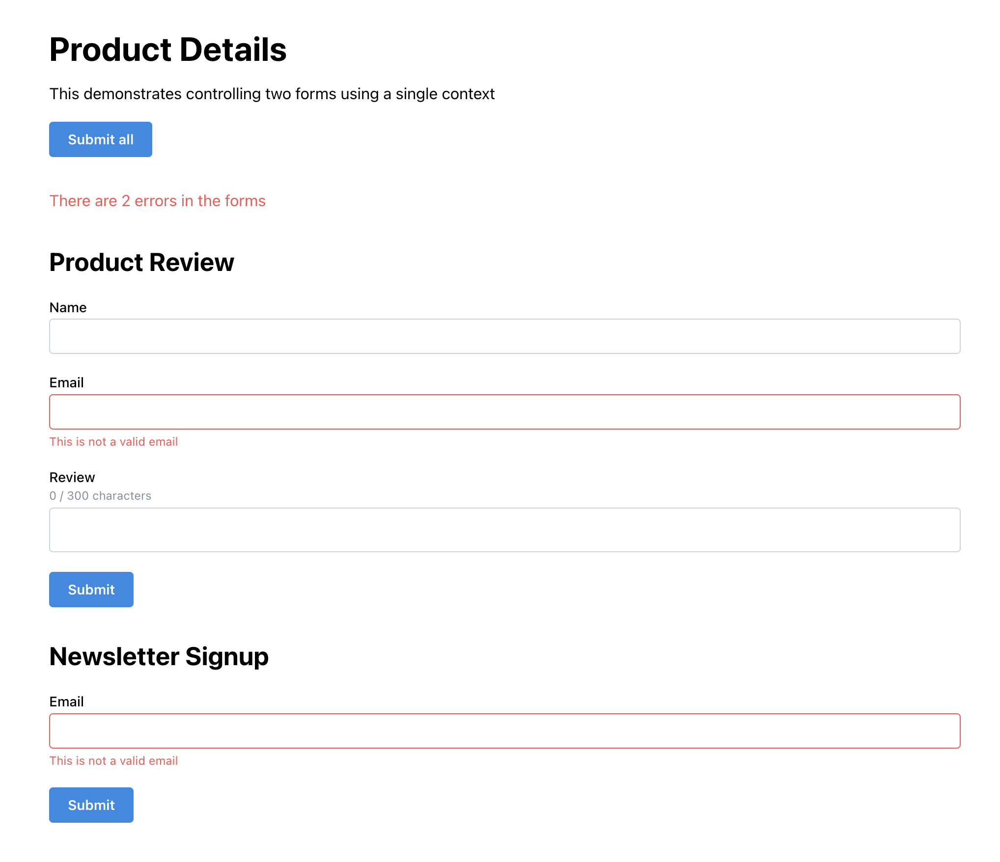

# TanStack Form Manager

This project demos how to use TanStack Form in a way that enables a single source of truth for form state management.

This works regardless of how many forms you have on a page and allows you to see errors across forms, submit all forms at once, and more.
